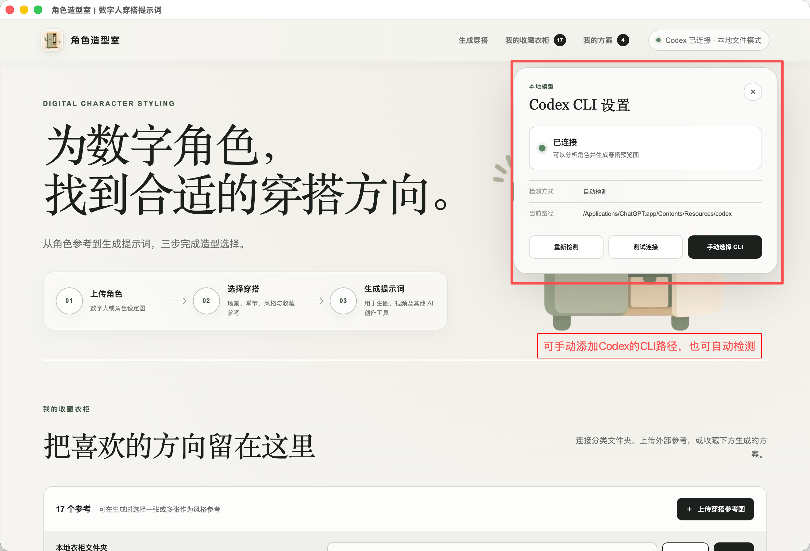
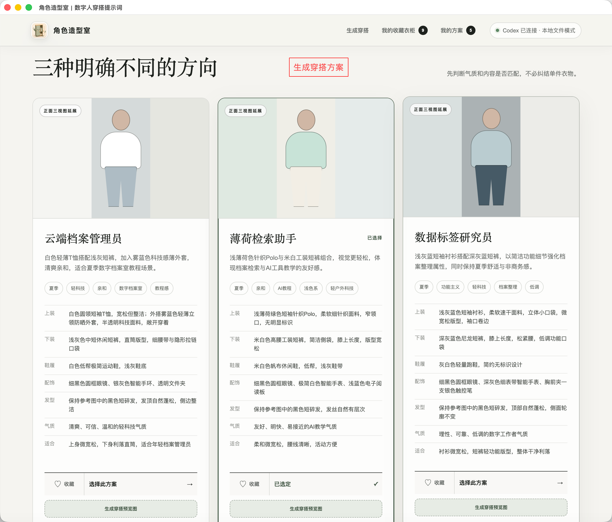
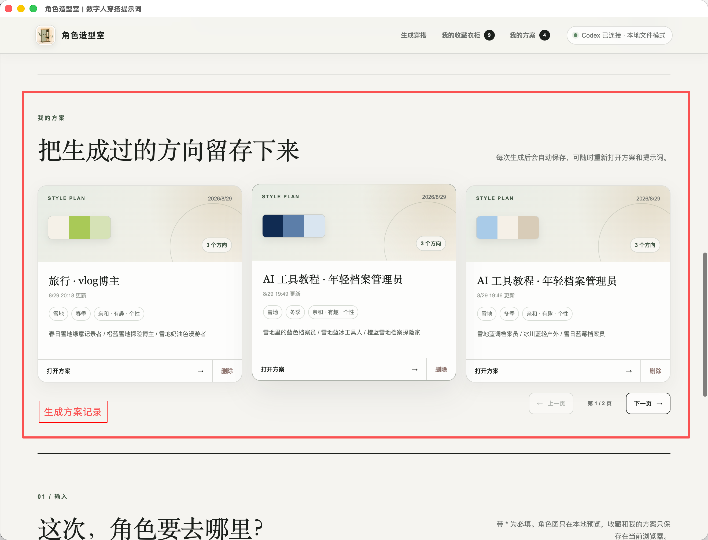
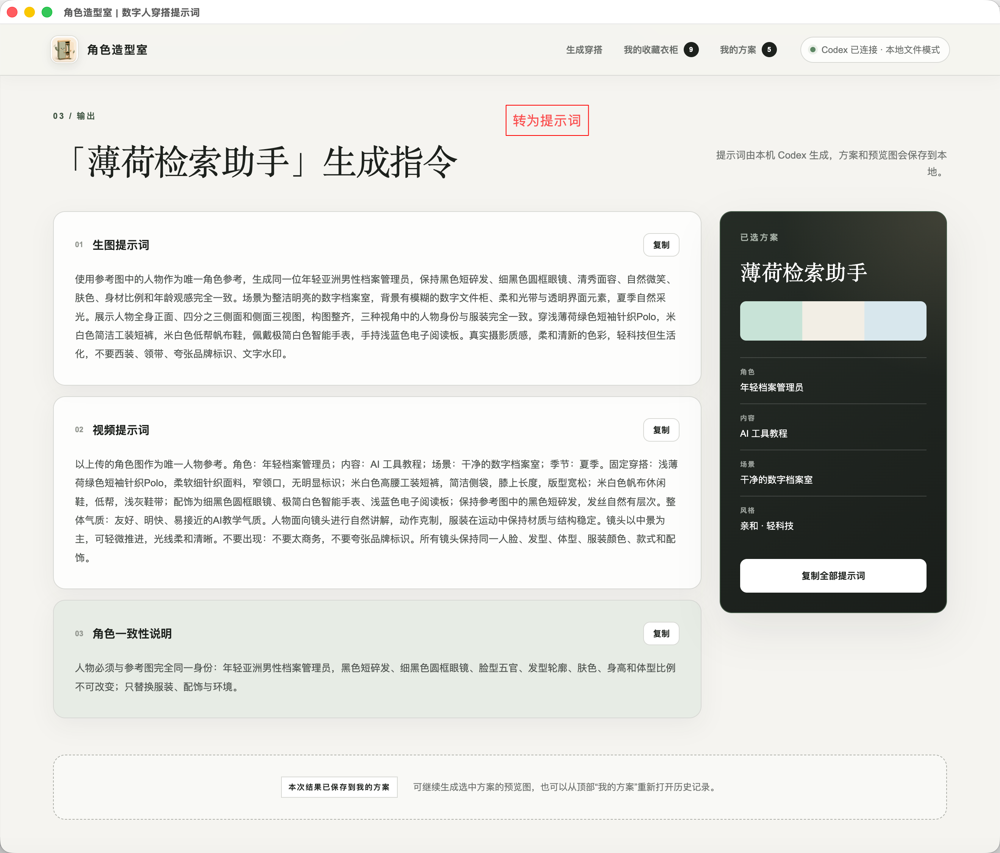

# 角色造型室

本地优先的数字角色穿搭方案与 AI 提示词生成工具。它可以读取本机已经分类的衣柜参考图，结合角色图片生成多套穿搭方向，并保存方案和提示词，方便后续继续使用。

## 功能

- 本地文件夹衣柜：按文件夹分类读取穿搭参考图，不移动或删除原图
- 角色图片上传与穿搭参考选择
- 生成 3 套结构化穿搭方案
- 为选中的方案生成生图、视频和角色一致性提示词
- “我的方案”：自动保存生成记录，支持重新打开、删除和分页浏览
- 本地优先：衣柜图片、生成结果和方案记录保存在本机
- Codex CLI 适配器：模型和存储层可替换，便于后续扩展

## 运行要求

- Node.js `>=22.13.0`
- macOS 桌面版需要 Electron；当前打包流程优先验证 Apple Silicon（arm64）
- 使用真实 Codex 生成功能时，需要在本机安装并登录可用的 ChatGPT/Codex CLI

没有本地 Codex CLI 时，网页仍可以启动并使用演示模式查看界面流程。

## 快速开始

```bash
npm install
npm run dev
```

打开终端提示的本地地址即可查看网页模式。网页模式下，本地服务未连接时会使用演示方案。

构建网页：

```bash
npm run build
```

启动 Electron 调试版：

```bash
npm run desktop:dev
```

生成当前 Mac 架构的 ZIP：

```bash
npm run desktop:zip
```

生成的安装包会放在 `desktop-dist/`，该目录已加入 `.gitignore`，不应提交到 Git 历史；正式安装包请通过 GitHub Releases 发布。

## 功能预览

### 连接本地 Codex CLI

可以自动检测 Codex CLI，也可以手动选择本机的 CLI 路径。



### 连接衣柜文件夹

选择已经分类整理的本地穿搭参考文件夹，应用会读取图片并保留原目录不变。


### 输入角色与筛选条件

上传角色参考图，填写角色身份、主题、场景和风格方向，并选择要参考的收藏穿搭。


### 生成多套穿搭方向

应用会生成三套结构化穿搭方向，可先比较方案，再选择需要继续生成预览图的方案。



### 保存和浏览我的方案

每次生成的方案会自动保存到“我的方案”，支持重新打开、删除和分页浏览。



### 复制 AI 提示词

选中方案后，可以复制生图、视频和角色一致性提示词。



## 本地数据与隐私

桌面版默认把运行记录、方案和生成图片写入系统应用数据目录，不会写回衣柜原图目录。开发模式下的临时数据默认位于被忽略的 `local-data/`。

真实 AI 请求会通过本机 Codex CLI 执行。使用者应在提交 issue 或日志前检查并移除角色图片、个人路径及其他敏感内容。

## 项目结构

```text
app/                 React 页面与样式
desktop/             Electron 主进程和 preload
local-core/          本地服务、Codex 适配器、本地文件存储与数据校验
public/              应用图标和页面视觉资源
tests/               本地服务与适配器测试
vite.config.ts       vinext/Vite 构建配置
```

主要端口：

- `43127`：本地模型与文件服务，仅监听 `127.0.0.1`
- `43128`：桌面版网页服务，仅监听 `127.0.0.1`

## 测试与维护

```bash
npm run test:local
npm run build
```

提交代码前请至少运行以上两项。依赖版本通过 `package-lock.json` 锁定，建议使用 Node.js 22 LTS 及 npm 安装依赖。

分支和发布约定见 [CONTRIBUTING.md](CONTRIBUTING.md)。安全问题请不要直接公开提交 issue，见 [SECURITY.md](SECURITY.md)。

## 开源许可

本项目使用 MIT License，详见 [LICENSE](LICENSE)。第三方依赖仍以各自许可证为准。
